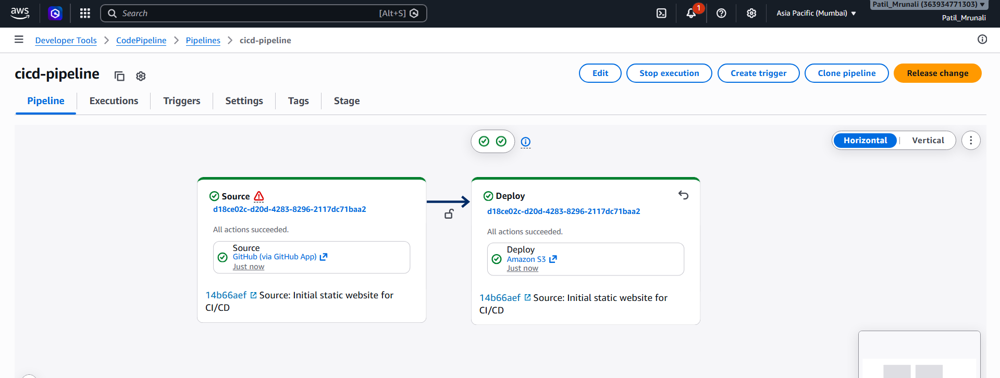
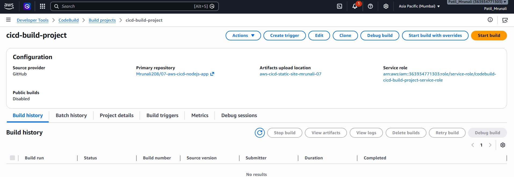
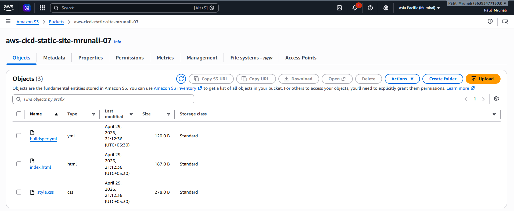
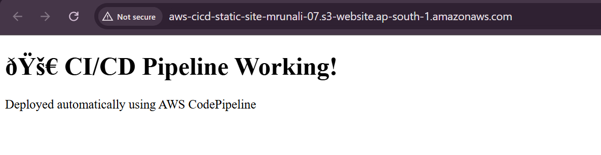

# 🚀 AWS CI/CD Pipeline for Automated Static Website Deployment (GitHub + CodePipeline + S3)

## 🚀 Project Overview

This project demonstrates a fully automated CI/CD pipeline on AWS that deploys a static website directly from GitHub to Amazon S3 using AWS CodePipeline and CodeBuild.

Whenever code is pushed to GitHub, the pipeline automatically builds (if required) and deploys the updated website to an S3 bucket without any manual intervention.

---

## 🎯 Objectives

* Implement a fully automated CI/CD pipeline
* Integrate GitHub with AWS deployment services
* Automate static website deployment to S3
* Understand real-world DevOps workflows
* Eliminate manual deployment process
* Build industry-level DevOps project experience

---

## 🧰 AWS Services Used

* AWS CodePipeline (CI/CD orchestration)
* AWS CodeBuild (Build automation - optional)
* Amazon S3 (Static website hosting)
* GitHub (Source control)
* AWS IAM (Permissions and roles)

---

## 🏗️ Architecture

### 🔹 Architecture Diagram (Simplified)
GitHub Repository
│
▼
AWS CodePipeline
│
▼
AWS CodeBuild (Optional Build Stage)
│
▼
Amazon S3 Bucket (Hosting Static Website)
│
▼
Live Website Deployment

---

### 🔹 CI/CD Flow

GitHub Push → CodePipeline Trigger → CodeBuild Execution → S3 Deployment → Website Updated Automatically

---

## ⚙️ Key Features

✔ Fully automated CI/CD pipeline  
✔ Zero manual deployment required  
✔ GitHub integration with AWS services  
✔ Static website hosting on S3  
✔ Scalable DevOps workflow  
✔ Real-time deployment on code push  

---

## 📁 Project Structure
07-aws-cicd-nodejs-app/
│
├── index.html
├── styles.css
├── script.js
├── buildspec.yml
├── README.md
│
└── screenshots/

---

## 🛠️ Implementation Steps

### 🔹 Step 1: Create S3 Bucket

* Bucket Name: `aws-cicd-static-site-mrunali-07`
* Enabled Static Website Hosting
* Configured public access permissions

---

### 🔹 Step 2: Configure GitHub Repository

* Repository connected via AWS CodePipeline
* Branch used: `main`
* Source: GitHub (via AWS CodeStar Connection)

---

### 🔹 Step 3: Create CodePipeline

* Pipeline Name: `cicd-pipeline`
* Source Stage: GitHub
* Build Stage: CodeBuild (optional)
* Deploy Stage: Amazon S3

---

### 🔹 Step 4: Configure CodeBuild (Optional)

* Build Project: `cicd-build-project`
* Runtime: Node.js (if required)
* Commands:
ls
echo "Hello World"

---

### 🔹 Step 5: Deploy to S3

* Output artifacts automatically pushed to S3 bucket
* Files extracted before deployment
* Website updated instantly

---

## 🧪 Testing & Output

✔ Code pushed to GitHub  
✔ Pipeline triggered automatically  
✔ Build stage executed successfully  
✔ Files deployed to S3 bucket  
✔ Website updated in real-time  

---

## 🌐 Live Website

👉 Hosted on Amazon S3 Static Website Hosting
http://aws-cicd-static-site-mrunali-07.s3-website-ap-south-1.amazonaws.com

---

## 📸 Screenshots

### 🔹 CodePipeline Success

### 🔹 CodeBuild Logs

### 🔹 S3 Bucket Files

### 🔹 Live Website Output

---

## ⚠️ Challenges Faced

* GitHub connection via AWS CodeStar setup issues  
* S3 deployment permission errors  
* CodePipeline trigger configuration  
* Understanding artifact flow between stages  
* Debugging build stage output  

---

## ✅ Solutions Implemented

* Proper IAM roles configured for CodePipeline  
* Enabled automatic artifact extraction in S3  
* Fixed GitHub connection using AWS CodeStar  
* Simplified CodeBuild step for static deployment  
* Verified pipeline execution logs in CloudWatch  

---

## 📚 Key Learnings

* CI/CD pipeline automation in AWS  
* GitHub integration with AWS services  
* CodePipeline architecture and workflow  
* S3 static website hosting  
* DevOps automation principles  
* Real-world deployment pipeline design  

---

## 🚀 Future Improvements

* Add EC2-based deployment instead of S3  
* Integrate automated testing stage  
* Add rollback mechanism  
* Use Terraform for infrastructure as code  
* Add monitoring using CloudWatch alerts  

---

## 👩‍💻 Author

Mrunali Patil